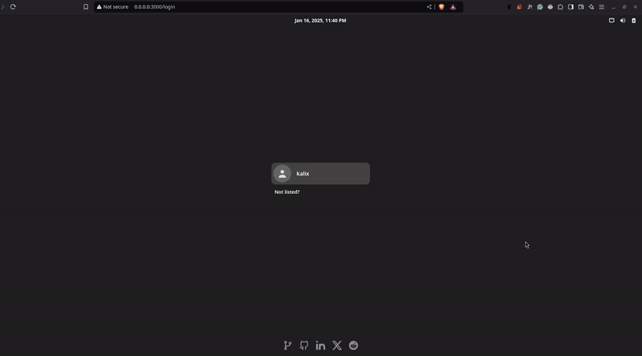

<a id="top"></a>

<div align="center">
    <h1 align="center">KalixOS</h1>
    <p align="center">
        <a href="https://os.gianlucaiavicoli.dev" target="_blank">View Demo</a>
        &middot;
        <a href="https://github.com/kalix127/kalixOS/issues/new?labels=bug&template=bug_report.md" target="_blank">Report Bug</a>
        &middot;
        <a href="https://github.com/kalix127/kalixOS/issues/new?labels=feature&template=feature_request.md" target="_blank">Request Feature</a>
    </p>
    
</div>

### Table of Contents

1.  [About The Project](#about-the-project)
    - [Key Features](#key-features)
    - [Terminal Commands and Features](#terminal-commands-and-features)
2.  [Built With](#built-with)
3.  [Usage](#usage)
4.  [Contributing](#contributing)
5.  [License](#license)
6.  [Contact](#contact)
7.  [Acknowledgments](#acknowledgments)

## About The Project

**KalixOS** brings the full experience of a Linux desktop environment to the browser, inspired by the functionality and aesthetics of the Manjaro operating system. It features a responsive, interactive, and immersive web app that mimics a real OS.

The application offers a nearly complete Linux filesystem logic, allowing you to create, modify, and delete directories and files seamlessly. Users can browse the web using the built-in web browser or interact with a terminal that supports a variety of Linux commands, offering an authentic command-line experience.

This web-based OS includes several OS-like features to enhance the realism and showcase its capabilities:

- **System Operations**: Realistic shutdown and restart functionality, complete with viewable startup logs for a genuine Linux experience.
- **Settings Menu**: A fully interactive settings menu for customizing the environment.
- **WiFi Manager**: A simulated WiFi list to replicate network connection management.
- **Built-in Apps**: Functional applications such as a built-in version of **VS Code**, **Kate** for modifying files and system settings, alongside others, designed primarily to showcase functionality rather than for regular daily use.

Designed for both functionality and portability, this project is a powerful demonstration of what can be achieved with modern web development frameworks. Whether you're a developer looking for inspiration or an enthusiast exploring new technologies, this project showcases the best of Linux OS simulation in a browser.

### Key Features:

- **Linux Filesystem**: Create, modify, delete, and manage files and directories.
- **Web Browser**: Functional for browsing the internet.
- **Terminal Emulator**: Execute Linux commands with features like bash history and tab autocomplete.
- **OS-Like Functionalities**: Simulated system operations, startup logs, settings, and network management.
- **Built-in Applications**: Showcase functional apps like **VS Code** in the browser.
- **Multi-Language Support**: Full support for both English and Italian languages throughout the interface.
- **Localized Content**: All menus and application interfaces are properly translated both in English and Italian.

### Terminal Commands and Features:

- **Supported Commands**:
    - `ls`: List information about files in the current directory.
    - `cd`: Change the working directory.
    - `ln`: Create links between files.
    - `pwd`: Print the absolute path of the current working directory.
    - `tree`: Display a tree of the directory structure.
    - `chown`: Change the owner/group of files.
    - `chmod`: Change the mode/permissions of files.
    - `touch`: Create a file if it does not exist.
    - `mkdir`: Create a new directory.
    - `mv`: Move or rename files.
    - `rm`: Remove files.
    - `cat`: Print file contents to output.
    - `ps`: Report snapshot of current processes.
    - `kill`: Close an application by PID.
    - `pkill`: Close an application by name.
    - `free`: Display system memory usage.
    - `df`: Show disk space usage.
    - `whoami`: Print current username.
    - `clear`: Clear the terminal screen.
    - `neofetch`: Display system information.
- **Advanced Features**:
    - **Bash History**: Easily recall previously executed commands.
    - **Tab Autocomplete**: Quickly autocomplete filenames, directories, or commands for a smooth user experience.

### Built With:


## Usage

You can try out kalixOS right now by visiting [os.gianlucaiavicoli.dev](https://os.gianlucaiavicoli.dev). The web-based OS is ready to use with no installation required - simply open it in your browser to start exploring the Linux desktop environment, try out the terminal commands, browse files, and test the built-in applications.

Feel free to experiment with all the features described above, from basic file operations to advanced terminal commands. The environment is reset on page refresh, so you can't break anything!

## Contributing

Please check out our [Contributing Guidelines](CONTRIBUTING.md) for detailed information about how to contribute to this project.

Contributions are what makes the open-source community such an amazing place to learn, inspire, and create. Any contributions you make are **greatly appreciated**.

If you have a suggestion that would make this better, please fork the repo and create a pull request. You can also simply open an issue with the tag "feature". Don't forget to give the project a star!

This project uses pnpm as the package manager. If you don't have it installed, please follow the [official installation guide](https://pnpm.io/installation).
To contribute:

1.  Fork the Project
2.  Clone your fork. Remember to replace `<your-username>` with your actual GitHub username :)
    ```
    git clone https://github.com/<your-username>/kalixOS.git
    ```
3.  Install dependencies
    ```
    pnpm install
    ```
4.  Create your Feature Branch
    ```
    git checkout -b feature/AmazingFeature
    ```
5.  Commit your Changes
    ```
    git commit -m 'feat: add some amazing feature'
    ```
6.  Push to the Branch
    ```
    git push origin feature/AmazingFeature
    ```
7.  Open a Pull Request

## License

[LICENSE](LICENSE)

## Contact

Gianluca Iavicoli - [LinkedIn](https://www.linkedin.com/in/gianluca-iavicoli-684b32262) - [info@gianlucaiavicoli.dev](mailto:info@gianlucaiavicoli.dev)

## Acknowledgments

- [Xterm.js](https://xtermjs.org/) - Terminal emulator used for the web terminal
- [Icônes](https://icones.js.org/) - Icon explorer with instant searching from various icon sets
- [adw-gtk3 GTK Theme](https://github.com/lassekongo83/adw-gtk3)
- [Papirus Icon Theme](https://github.com/PapirusDevelopmentTeam/papirus-icon-theme)

([back to top](#readme-top))
