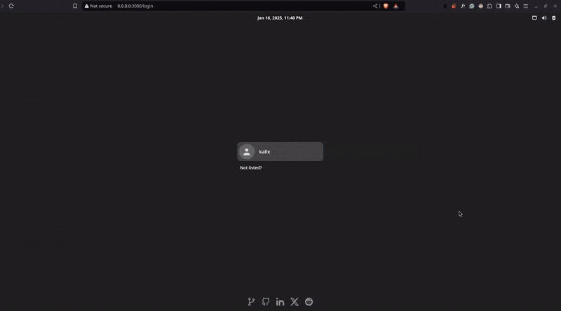

<a id="top"></a>

<div align="center">
    <h1 align="center">KalixOS</h1>
    <p align="center">
        <a href="https://os.gianlucaiavicoli.dev" target="_blank">View Demo</a>
        &middot;
        <a href="https://github.com/kalix127/kalixOS/issues/new?labels=bug&template=bug_report.md" target="_blank">Report Bug</a>
        &middot;
        <a href="https://github.com/kalix127/kalixOS/issues/new?labels=feature&template=feature_request.md" target="_blank">Request Feature</a>
    </p>
    
</div>

### Table of Contents

1.  [About The Project](#about-the-project)
    - [Key Features](#key-features)
    - [Terminal Commands and Features](#terminal-commands-and-features)
2.  [Built With](#built-with)
3.  [Usage](#usage)
4.  [Contributing](#contributing)
5.  [License](#license)
6.  [Contact](#contact)
7.  [Acknowledgments](#acknowledgments)

## About The Project

**KalixOS** is my take on a Linux desktop in the browser, inspired by the look and flow of Manjaro. The goal is simple: make it feel like an OS, not just a demo page. It is responsive, interactive, and built to be explored.

Under the hood there is a lightweight filesystem model, so you can create, rename, and delete files and folders like you would on a real machine. There is also a terminal with a growing set of familiar commands, plus a browser app so you can jump out to the web from inside the desktop.

Here are a few of the OS-like touches that make it feel real:

- **System Operations**: Shutdown and restart are simulated, with boot logs you can actually read.
- **Settings Menu**: A real settings panel for tweaking the environment.
- **WiFi Manager**: A mock network list to mirror connection management.
- **Built-in Apps**: Apps like a browser, a VS Code-inspired editor, and Kate for files and settings. They are here to show what the UI can do, not to replace your daily tools.

If you are into web UI, OS design, or just want to poke around a fake Linux box in the browser, this project is for you.

### Key Features

- **Linux Filesystem**: Create, modify, delete, and manage files and directories.
- **Web Browser**: Functional for browsing the internet.
- **Terminal Emulator**: Execute Linux commands with features like bash history and tab autocomplete.
- **OS-Like Functionalities**: Simulated system operations, startup logs, settings, and network management.
- **Built-in Applications**: Showcase functional apps like **VS Code** in the browser.
- **Multi-Language Support**: Full support for both English and Italian languages throughout the interface.
- **Localized Content**: All menus and application interfaces are properly translated both in English and Italian.

### Terminal Commands and Features

- **Supported Commands**:
    - `ls`: List information about files in the current directory.
    - `cd`: Change the working directory.
    - `ln`: Create links between files.
    - `pwd`: Print the absolute path of the current working directory.
    - `tree`: Display a tree of the directory structure.
    - `chown`: Change the owner/group of files.
    - `chmod`: Change the mode/permissions of files.
    - `touch`: Create a file if it does not exist.
    - `mkdir`: Create a new directory.
    - `mv`: Move or rename files.
    - `rm`: Remove files.
    - `cat`: Print file contents to output.
    - `ps`: Report snapshot of current processes.
    - `kill`: Close an application by PID.
    - `pkill`: Close an application by name.
    - `free`: Display system memory usage.
    - `df`: Show disk space usage.
    - `whoami`: Print current username.
    - `clear`: Clear the terminal screen.
    - `neofetch`: Display system information.
- **Advanced Features**:
    - **Bash History**: Easily recall previously executed commands.
    - **Tab Autocomplete**: Quickly autocomplete filenames, directories, or commands for a smooth user experience.

### Built With


## Usage

Open [os.gianlucaiavicoli.dev](https://os.gianlucaiavicoli.dev) and start clicking around. There is nothing to install; it runs entirely in the browser. Try the terminal, create a few files, and launch the built-in apps.

Everything resets on refresh, so do not worry about breaking anything.

## Contributing

Please read the [Contributing Guidelines](CONTRIBUTING.md) before sending changes.

If you want to help, the easiest path is to fork the repo and open a PR. You can also open an issue with a clear description of the idea or bug.

This project uses pnpm. If you need it, see the [installation guide](https://pnpm.io/installation).

Quick start:

1.  Fork the Project
2.  Clone your fork. Remember to replace `<your-username>` with your actual GitHub username :)
    ```
    git clone https://github.com/<your-username>/kalixOS.git
    ```
3.  Install dependencies
    ```
    pnpm install
    ```
4.  Create your Feature Branch
    ```
    git checkout -b feature/AmazingFeature
    ```
5.  Commit your Changes
    ```
    git commit -m 'feat: add some amazing feature'
    ```
6.  Push to the Branch
    ```
    git push origin feature/AmazingFeature
    ```
7.  Open a Pull Request

## License

See [LICENSE](LICENSE).

## Contact

Gianluca Iavicoli - [LinkedIn](https://www.linkedin.com/in/gianluca-iavicoli-684b32262) - [info@gianlucaiavicoli.dev](mailto:info@gianlucaiavicoli.dev)

## Acknowledgments

- [Xterm.js](https://xtermjs.org/) - Terminal emulator used for the web terminal
- [Icônes](https://icones.js.org/) - Icon explorer with instant searching from various icon sets
- [adw-gtk3 GTK Theme](https://github.com/lassekongo83/adw-gtk3)
- [Papirus Icon Theme](https://github.com/PapirusDevelopmentTeam/papirus-icon-theme)

([back to top](#top))
